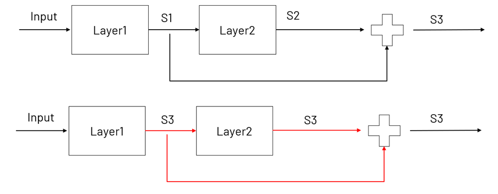
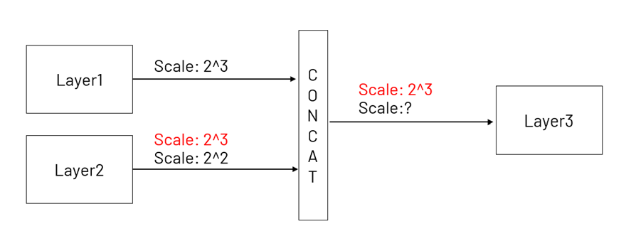

# Quantization Aware Training (QAT)

This document aims to explain Quantization Aware Training framework for MAX7800x series microcontrollers. QAT for MAX7800x consists of four main stages:
Activation Statistics Collection, Activation Threshold Determination, Scale Adjustments, and Weights Quantization.

## Activation Statistics Collection

To train a quantization-aware model, the first step is to collect activation statistics. The activation statistics are collected by running the model on the training dataset. The training script includes the activation statistics collection step(stat_collect() function). The activation statistics are the histogram of the activations for each layer.

## Activation Threshold Determination

The collected statistics are use to determine the activation thresholds. To do this, first, an outlier removal step based on z-score is applied to the activation statistics. The default z-score is 8.0, and it can be changed by defining a z-score on the qat policy file. Then, an iterative algorithm [1] that minimizes the quantization error by adjusting the threshold to determine the full activation range. This algorithm finds a balance point in the tradeoff between range and resolution. Scales are calculated as powers of two, making the scaling-down operation more computationally efficient by defining them as bit shift operations at the edge hardware.

## Scale Adjustments

To implement the threshold-based quantization, the scales of the layers are adjusted. The scales are adjusted based on the type of operation that is performed on the layers. The scale adjustments are made for residual additions, concatenations, and layer sharing. Figure 1. shows the scale adjustments for residual additions. In the figure, Layer1 and Layer2 are layers that are added together. The scale of the residual addition is selected as the scale of the layers that are connected to the residual addition.

Figure 1. Scale Adjustments for Residual Additions

Figure 2. shows the scale adjustments for concatenations. In the figure, Layer1 and Layer2 are layers that are concatenated. The maximum scale of the layers is selected as the scale for the concatenated layer.

Figure 2. Scale Adjustments for Concatenations

Figure 3. shows the scale adjustments for layer sharing. In the figure, Layer1, Layer2 and Layer3 are layers that share weights. The maximum scale of the layers is selected as the scale for the shared layer.

Figure 3. Scale Adjustments for Layer Sharing

Figure 4. provides a simplified diagram showing how the scaling-down and scale carry-over operations are implemented. In the diagram, Layer1 and Layer2 represent linear layers with weights w1 and w2, and biases b1 and b2. S1 and S2 represent the activation scales, which are calculated as previously described. As shown, the output of Layer1 is scaled down using the S1 threshold, and the scale carry-over operation is achieved by adjusting
Layer2’s scale and dividing its biases accordingly.

Figure 4. Scaling-down and Scale Carry Over Diagram

## Weights Quantization

After determining the activation thresholds and scales, the next step is to quantize the weights. The weights are quantized using the QAT framework, which is based on the method proposed by Jacob et al. [2]. While training the model, weights and biasses are fake quantized to integers. The fake quantization is done by quantizing the weights and biases to integers and then dequantizing them back to floating-point numbers.

## Deploying the Quantized Model

The output shifts from the weights quantization are merged with the scale shifts from the activation quantization to form the final shifts of the quantized model. When the model is deployed, the final layer's scale should be restored to the original scale by multiplying the outputs with the final layer's scale. In the auto-generated C code, the cnn_unload() function is responsible for restoring the final layer's scale. If the cnn_unload() function is not used, the final layer's scale should be restored manually by multiplying the outputs with the final layer's scale. The final layer's scale values can be found at the cnn.c file in the comments section.

## References

[1] [Habi, Hai Victor, et al. "Hptq: Hardware-friendly post training quantization." arXiv preprint arXiv:2109.09113 (2021).](https://arxiv.org/abs/2109.09113)

[2] [Jacob, B., Kligys, S., Chen, B., Zhu, M., Tang, M., Howard, A., ... & Kalenichenko, D. (2018). Quantization and training of neural networks for efficient integer-arithmetic-only inference. In Proceedings of the IEEE conference on computer vision and pattern recognition (pp. 2704-2713).](https://openaccess.thecvf.com/content_cvpr_2018/papers/Jacob_Quantization_and_Training_CVPR_2018_paper.pdf)
